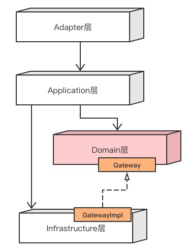
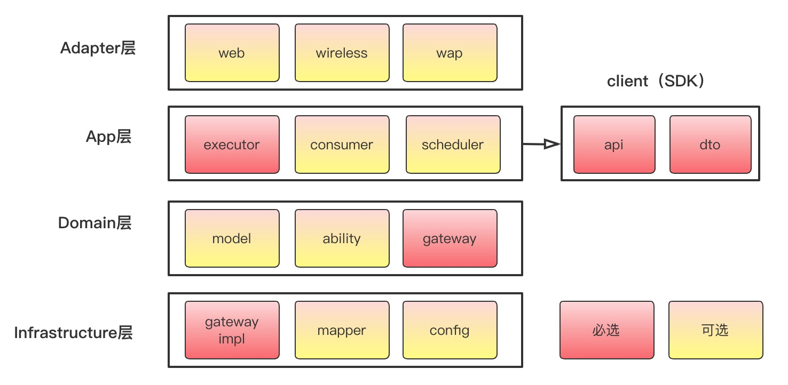
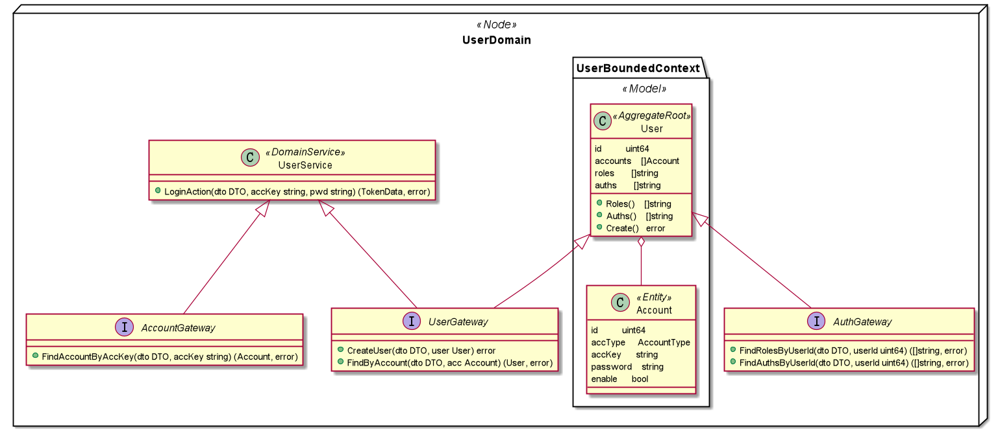
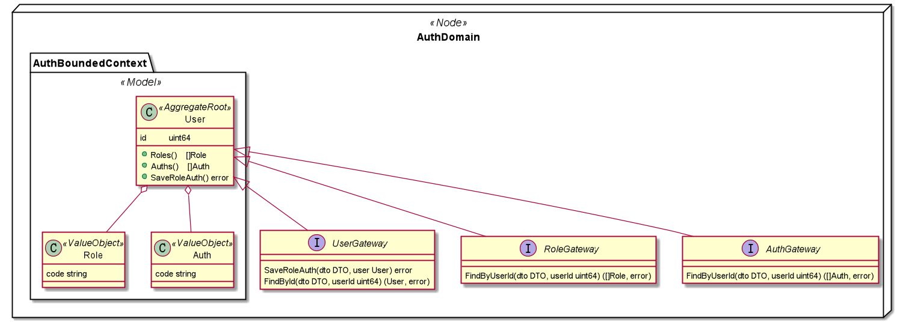
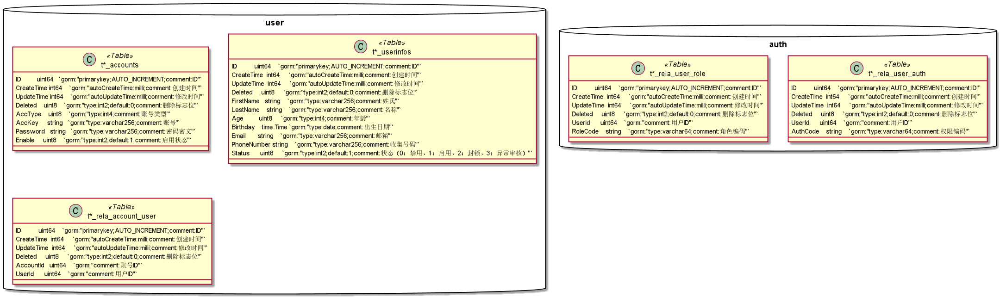

# COLAGO

这是一个基于alibaba/COLA架构思想，使用golang实现的一套微服务代码示例

## 代码分层架构设计

### 依赖结构定义



1）适配层（Adapter Layer）：负责对前端展示（web，wireless，wap）的路由和适配，对于传统B/S系统而言，adapter就相当于MVC中的controller；

2）应用层（Application Layer）：主要负责获取输入，组装上下文，参数校验，调用领域层做业务处理，如果需要的话，发送消息通知等。层次是开放的，应用层也可以绕过领域层，直接访问基础实施层；

3）领域层（Domain Layer）：主要是封装了核心业务逻辑，并通过领域服务（Domain Service）和领域对象（Domain Entity）的方法对App层提供业务实体和业务逻辑计算。领域是应用的核心，不依赖任何其他层次；

4）基础实施层（Infrastructure
Layer）：主要负责技术细节问题的处理，比如数据库的CRUD、搜索引擎、文件系统、分布式服务的RPC等。此外，领域防腐的重任也落在这里，外部依赖需要通过gateway的转义处理，才能被上面的App层和Domain层使用。

### 包定义



#### 代码包

```
colago/common                   公用组件，含依赖注入、orm等组件，非必要依赖，可以自己实现
colago/samples                  示例代码包
colago/samples/shared           含有grpc-proto,以及生成的通用go文件
colago/samples/user-domain      用户域服务
colago/samples/auth-domain      权限域服务
colago/samples/user-client      用户域服务客户端
colago/samples/auth-client      权限域服务客户端
colago/samples/docker-compose   测试环境搭建所需的基础设施
colago/samples/test             测试用例执行入口
```
 
### 示例领域模型



### 示例数据库模型


### 示例框架技术栈
    微服务通信协议 gRPC
    微服务信箱框架 protoactor
    服务注册中心 consul
    数据库 postgresql
    链路跟踪标准 opentelemetry-tracing
本代码库主要展示代码分层架构与领域驱动设计模型，所有应用技术都是解耦可替换的。
